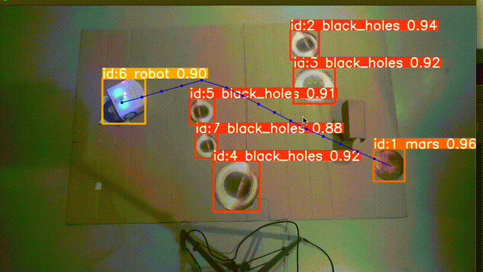

# Mobile-Robotics-Project

## 🧠 Overview
This project enables the thymio robot to find a global path from a start position to the goal while avoiding obstacles with gloabl and local avoiding using computer vision and filter techniques.
This group project is part of the course "Mobile Robotics" in Master 1 at EPFL.

  

## ⚙️ Technical Details

| Category | Details |
|-----------|----------|
| **Languages** | Python |
| **Frameworks / Libraries** | `tdmclient`, `OpenCV`, `NumPy`, `ultralytics` (YOLO), `math` |
| **Techniques** | Global path planning, obstacle detection via YOLO-based computer vision, Markov localization, probabilistic filtering, trajectory smoothing |
| **Hardware** | Thymio mobile robot, external camera for global tracking, on-board proximity sensors |
| **Environment** | Ubuntu 22.04, Python 3.10, VS Code, Thymio firmware & `tdmclient` API |
| **Features** | End-to-end navigation system combining visual obstacle detection with Markov-based localization and local avoidance control; includes simulation and real-robot modes for debugging and evaluation |

